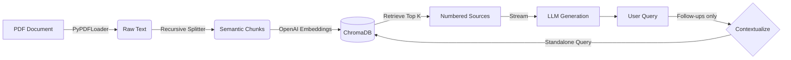

# InsightEngine: Enterprise-Grade RAG System

**Live Demo:** <a href="https://insight-engine-lndychhed8zm5vkhn8nemp.streamlit.app/" target="_blank">https://insight-engine-lndychhed8zm5vkhn8nemp.streamlit.app/</a>

InsightEngine is a document retrieval system built to bridge the gap between static knowledge bases (PDFs) and conversational AI. 

Tackle the actual challenges of production AI: state management, conversational memory, and explainability. The goal was to create a system that doesn't just "chat" with a PDF, but allows for reliable, verifiable research.

## The Problem
Most basic RAG implementations have two critical failures:
1. **Amnesia:** They treat every query as a new interaction, failing when a user asks "Why?" or "Tell me more about that."
2. **Hallucination:** They give answers without proof, making them dangerous for enterprise use.

InsightEngine solves these by implementing a history-aware retrieval chain and forcing the model to cite its sources explicitly.

## System Architecture

The application follows a strict "Ingestion -> Retrieval -> Generation" pipeline designed for observability.



## Key Capabilities

### Context-Aware Memory
Instead of passing raw chat history to the LLM (which confuses the vector search), the system uses a secondary LLM call to rewrite follow-up questions into standalone ones. The first question in a conversation skips this call entirely. 
* *User:* "How much does it cost?"
* *System Internal:* "How much does [the payment processing module mentioned previously] cost?"
* *Result:* The vector database actually finds the right answer.

### Source Verification (Citations)
Trust is the biggest bottleneck for AI adoption. This engine decouples the retrieval step from generation. Retrieved chunks are numbered and passed to the model, which is instructed to answer only from them and cite them inline (`[1]`, `[2]`). The same numbered sources (file name and page) appear in an expandable panel *before* the answer starts streaming, so every claim can be checked as it appears.

### Streaming Latency
Waiting 5+ seconds for a complete answer feels broken. Answers stream token by token through Python generators, so text starts appearing as soon as the model produces it, regardless of answer length.

### Isolated Sessions
Each browser session gets its own vector collection. On the public demo, visitors never see each other's documents, and "Reset Knowledge Base" only clears your own.

## Getting Started

### Prerequisites
* Python 3.10+
* Docker (Optional, but recommended)
* OpenAI API Key

### Running Locally
```bash
git clone https://github.com/eralme/Insight-Engine.git
cd Insight-Engine
python3 -m venv venv && source venv/bin/activate
pip install -r requirements.txt
cp .env.example .env   # then put your OpenAI key in .env
streamlit run app.py
```

### Running with Docker
```bash
docker compose up --build
```

### Running Tests
The tests use fake models, so they need no API key and make no network calls.
```bash
pip install -r requirements-dev.txt
pytest
```

### Configuration
| Variable | Default | Purpose |
| :--- | :--- | :--- |
| `OPENAI_API_KEY` | required | Read from `.env` locally or from the app's secrets on Streamlit Cloud. |
| `OPENAI_MODEL` | `gpt-4-turbo` | Chat model used for rewriting questions and generating answers. |

## Engineering Decisions

**Why Recursive Character Splitting?**
I chose `RecursiveCharacterTextSplitter` over simple token splitting because technical documents rely on structural context. Splitting blindly by token count often severs a header from its content. Recursive splitting respects paragraph and sentence boundaries, keeping semantic units intact.

**Why ChromaDB (Local)?**
For a portfolio/proof-of-work, a local persistent vector store reduces infrastructure overhead while still demonstrating how embedding storage works. The architecture is modular, so swapping `Chroma` for `Pinecone` or `Weaviate` in production would only require changing the connector in `rag_engine.py`.

## Future Improvements
* **Reranking:** Adding a Cross-Encoder step to score retrieved documents would significantly improve precision for niche queries.
* **Hybrid Search:** Combining vector search with keyword search (BM25) to better handle specific acronyms or ID numbers that semantic search sometimes misses.